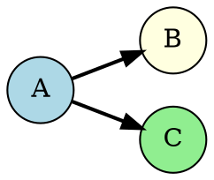

# Network Graph Visualization for DTN Routing

This module provides comprehensive network graph visualization capabilities for the OLSR and AODV routing algorithms. It allows you to extract the network topology as seen by each node and export it in various formats for visualization.

## Features

- **Graph Extraction**: Convert routing table information into a graph structure
- **Node and Edge Metadata**: Rich metadata for visualization customization
- **Multiple Export Formats**: DOT (Graphviz) and JSON formats
- **Protocol-Specific Views**: Different visualization for OLSR and AODV

## Usage

### Basic Graph Extraction

```swift
// Create and configure routing algorithm
let node = Node(id: "A")
let olsr = OLSR(localNode: node)

// Build network topology
olsr.neighborUp("B")
olsr.neighborUp("C")
// ... more topology setup ...

// Extract network graph
let graph = olsr.networkGraph()

// Access graph data
print("Nodes: \(graph.nodes)")
print("Edges: \(graph.edges)")
```

### Visualization Formats

#### DOT Format (Graphviz)

```swift
let dot = graph.exportDOT()
// Save to file and visualize with:
// dot -Tpng network.dot -o network.png
```

The DOT export includes:
- Node colors based on type (local=blue, MPR=green, neighbor=yellow)
- Edge styles (direct=solid, route=dashed, topology=gray)
- Edge weights (hop counts)

#### JSON Format

```swift
let json = graph.exportJSON()
// Use with D3.js, Cytoscape.js, or vis.js
```

The JSON format is compatible with popular JavaScript visualization libraries.

## Network Graph Structure

### Nodes

Each node in the graph has:
- **ID**: Unique identifier
- **Metadata**: Optional visualization hints
  - `label`: Display name
  - `type`: Node role (local, neighbor, mpr, remote)
  - `isLocal`: Boolean flag for the local node
  - `attributes`: Custom key-value pairs

### Edges

Each edge represents a link between nodes with:
- **Source**: Origin node ID
- **Destination**: Target node ID
- **Metadata**: Optional link information
  - `weight`: Cost or hop count
  - `type`: Link type (direct, route, topology)
  - `isActive`: Link status
  - `attributes`: Custom key-value pairs

## Protocol-Specific Visualizations

### OLSR Visualization

OLSR provides a comprehensive network view including:
- All discovered nodes
- Direct neighbor relationships
- MPR selections (highlighted in green)
- Topology information from TC messages
- Computed routes with hop counts

### AODV Visualization

AODV provides a limited view based on:
- Direct neighbors
- Active routes only
- Next hop information
- Route sequence numbers

## Example Visualizations

### Simple Network

```
     A (local)
    / \
   B   C (MPR)
   |   |
   D   E
```

### DOT Output



## Integration with Visualization Tools

### Graphviz

1. Save DOT output to file
2. Generate image: `dot -Tpng graph.dot -o graph.png`
3. Other formats: PDF, SVG, PS

### Web-based Visualization

Use the JSON export with:

1. **D3.js** - Force-directed graphs
2. **Cytoscape.js** - Interactive network visualization
3. **vis.js** - Dynamic network diagrams

### Example D3.js Integration

```javascript
const graphData = // JSON from graph.exportJSON()

const simulation = d3.forceSimulation(graphData.nodes)
    .force("link", d3.forceLink(graphData.edges).id(d => d.id))
    .force("charge", d3.forceManyBody())
    .force("center", d3.forceCenter(width / 2, height / 2));
```

## Advanced Usage

### Custom Metadata

```swift
var nodeMetadata: [String: NodeMetadata] = [:]
nodeMetadata["A"] = NodeMetadata(
    label: "Gateway",
    type: "router",
    attributes: ["cpu": "high", "battery": "75%"]
)

let graph = NetworkGraph(
    nodes: nodes,
    edges: edges,
    nodeMetadata: nodeMetadata
)
```

### Filtering Routes

```swift
// Only show active routes
let activeRoutes = aodv.getRoutes().filter { $0.isValid }
```

## Performance Considerations

- Graph extraction is O(n) where n is the number of routes
- DOT export is suitable for networks up to ~1000 nodes
- For larger networks, consider JSON export with clustering

## Future Enhancements

- GraphML export format
- Real-time updates via WebSocket
- 3D visualization support
- Network metrics (centrality, clustering)
- Animation of route discovery